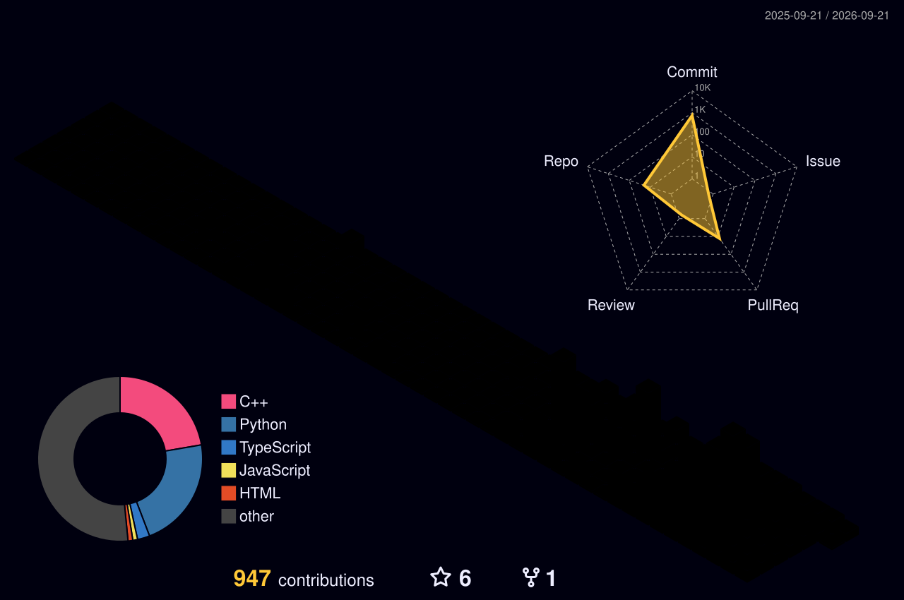

# Hi, I'm Paneendra Kumar 👋

<p align="center">
  
  
  
</p>

<a href="https://git.io/typing-svg"></a>

I am an engineering student passionate about **IoT**, **Mechatronics**, **Robotics**, and **Sim2Real**. As the **Lead of Autonomy** for ABU Robocon 2026, I enjoy integrating intelligent electronic control with precision mechanical design to build autonomous hardware.

<p align="center">
  
</p>

---

### 👨‍💻 About Me

- 🎓 Pursuing a **B.Tech in Mechanical Engineering at NIT Durgapur**
- 🤖 Leading **Autonomy & Control for ABU Robocon 2026**
- 🧠 Building at the intersection of **mechanical design, electronics, and intelligent software**
- ⚙️ Turning simulations and control algorithms into reliable real-world robotic systems
- 🏁 Exploring autonomous navigation, digital twins, sensor fusion, and competitive programming
- 🤝 Open to collaborating on **robotics, embedded systems, IoT, and open-source engineering**
- 💬 Have a question or project idea? [Start a conversation](https://github.com/paneendrakumar0/paneendrakumar0/issues/new?title=Let%27s%20build%20something&body=Hi%20Paneendra%2C%20I%27d%20like%20to%20talk%20about...)

### 🚀 Currently Building

- Autonomous navigation and trajectory-planning systems for competition robots
- Sim2Real workflows that connect **ROS2**, **Isaac Sim**, and physical hardware

### 📚 Currently Learning

- Advanced **ROS2** architecture and robot navigation
- **NVIDIA Isaac Sim** for robotics simulation
- Sensor fusion with **IMU** and **LiDAR**
- Scalable software architecture for multi-robot systems

---

### 🚀 Technical Expertise

#### Languages


#### Robotics, Embedded Systems & IoT


#### Design, Simulation & Developer Tools


---

### 🏗️ Featured Robotics Projects

1. **[SpiderVision-ReID](https://github.com/paneendrakumar0/spidervision-reid)** — Real-time object tracking and re-identification from live camera input.
2. **[Dynamic Dual-Arm Interception Simulation](https://github.com/paneendrakumar0/dual-arm-interception-simulation)** — A PyBullet simulation in which two robot arms track, intercept, and stabilize a moving component.
3. **[UAV Autonomous Telemetry](https://github.com/paneendrakumar0/uav-autonomous-telemetry)** — ROS 2 and PX4 SITL experiments for offboard control, telemetry logging, trajectory validation, and slung-payload simulation.
4. **[DroneNav-RL](https://github.com/paneendrakumar0/DroneNav-RL)** — Autonomous quadcopter navigation using reinforcement learning, range sensing, curriculum training, and reproducible evaluation.
5. **[ROS 2 Robotic Hand Digital Twin](https://github.com/paneendrakumar0/Robotic-Hand-Simulation-in-ROS2)** — Full finger articulation and wrist rotation visualized in RViz.

---

### ⚡ GitHub Data & Activity

<p align="center">
  
</p>

<details open>
  <summary><strong>📈 GitHub Stats</strong></summary>
  <br />
  <p align="center">
    
    
  </p>
</details>

<p align="center">
  
</p>

[](https://github.com/paneendrakumar0)

### 🌌 3D Contribution Calendar

<p align="center">
  
</p>

<details>
  <summary><strong>📊 Live Detailed GitHub Metrics</strong></summary>
  <br />
  <p align="center">
    
  </p>
</details>

---

**:zap: Recent Activity:**

<!--START_SECTION:activity-->
1. 🎉 Merged PR [#6](https://github.com/paneendrakumar0/uav-autonomous-telemetry/pull/6) in [paneendrakumar0/uav-autonomous-telemetry](https://github.com/paneendrakumar0/uav-autonomous-telemetry)
<!--END_SECTION:activity-->

---

### ⏳ Time Tracking & Dev Metrics

<!--START_SECTION:waka-simple-->

```text
From: 02 June 2026 - To: 05 August 2026

Total Time: 49 hrs 48 mins

Markdown           23 hrs 38 mins  ⣿⣿⣿⣿⣿⣿⣿⣿⣿⣿⣿⣷⣀⣀⣀⣀⣀⣀⣀⣀⣀⣀⣀⣀⣀   47.47 %
Python             8 hrs 47 mins   ⣿⣿⣿⣿⣤⣀⣀⣀⣀⣀⣀⣀⣀⣀⣀⣀⣀⣀⣀⣀⣀⣀⣀⣀⣀   17.64 %
JavaScript         4 hrs 32 mins   ⣿⣿⣤⣀⣀⣀⣀⣀⣀⣀⣀⣀⣀⣀⣀⣀⣀⣀⣀⣀⣀⣀⣀⣀⣀   09.11 %
YAML               2 hrs 37 mins   ⣿⣤⣀⣀⣀⣀⣀⣀⣀⣀⣀⣀⣀⣀⣀⣀⣀⣀⣀⣀⣀⣀⣀⣀⣀   05.27 %
PowerShell         2 hrs 26 mins   ⣿⣄⣀⣀⣀⣀⣀⣀⣀⣀⣀⣀⣀⣀⣀⣀⣀⣀⣀⣀⣀⣀⣀⣀⣀   04.90 %
Other              1 hr 19 mins    ⣶⣀⣀⣀⣀⣀⣀⣀⣀⣀⣀⣀⣀⣀⣀⣀⣀⣀⣀⣀⣀⣀⣀⣀⣀   02.64 %
```

<!--END_SECTION:waka-simple-->

<!--START_SECTION:waka-->


**I'm an Early 🐤** 

```text
🌞 Morning                245 commits         ██░░░░░░░░░░░░░░░░░░░░░░░   08.17 % 
🌆 Daytime                1606 commits        █████████████░░░░░░░░░░░░   53.59 % 
🌃 Evening                1110 commits        █████████░░░░░░░░░░░░░░░░   37.04 % 
🌙 Night                  36 commits          ░░░░░░░░░░░░░░░░░░░░░░░░░   01.20 % 
```
📅 **I'm Most Productive on Thursday** 

```text
Monday                   168 commits         █░░░░░░░░░░░░░░░░░░░░░░░░   05.61 % 
Tuesday                  126 commits         █░░░░░░░░░░░░░░░░░░░░░░░░   04.20 % 
Wednesday                292 commits         ██░░░░░░░░░░░░░░░░░░░░░░░   09.74 % 
Thursday                 1513 commits        █████████████░░░░░░░░░░░░   50.48 % 
Friday                   102 commits         █░░░░░░░░░░░░░░░░░░░░░░░░   03.40 % 
Saturday                 522 commits         ████░░░░░░░░░░░░░░░░░░░░░   17.42 % 
Sunday                   274 commits         ██░░░░░░░░░░░░░░░░░░░░░░░   09.14 % 
```


📊 **This Week I Spent My Time On** 

```text
🕑︎ Time Zone: Asia/Kolkata

💬 Programming Languages: 
Python                   3 hrs 18 mins       █████████░░░░░░░░░░░░░░░░   34.82 % 
Markdown                 2 hrs 18 mins       ██████░░░░░░░░░░░░░░░░░░░   24.23 % 
Other                    1 hr 3 mins         ███░░░░░░░░░░░░░░░░░░░░░░   11.18 % 
Git Config               39 mins             ██░░░░░░░░░░░░░░░░░░░░░░░   06.93 % 
C#                       31 mins             █░░░░░░░░░░░░░░░░░░░░░░░░   05.58 % 

🔥 Editors: 
Antigravity IDE          9 hrs 29 mins       █████████████████████████   100.00 % 

🐱‍💻 Projects: 
uav-autonomous-telemetry 3 hrs 33 mins       █████████░░░░░░░░░░░░░░░░   37.44 % 
iARCweldingsimulator     1 hr 24 mins        ████░░░░░░░░░░░░░░░░░░░░░   14.87 % 
dual-arm-interception-sim1 hr 10 mins        ███░░░░░░░░░░░░░░░░░░░░░░   12.39 % 
waste-segregation-bot    1 hr 1 min          ███░░░░░░░░░░░░░░░░░░░░░░   10.76 % 
profile-publish          57 mins             ███░░░░░░░░░░░░░░░░░░░░░░   10.01 % 

💻 Operating System: 
Windows                  9 hrs 29 mins       █████████████████████████   100.00 % 
```

**I Mostly Code in Python** 

```text
Python                   12 repos            █████████░░░░░░░░░░░░░░░░   37.50 % 
C++                      4 repos             ███░░░░░░░░░░░░░░░░░░░░░░   12.50 % 
C#                       2 repos             ██░░░░░░░░░░░░░░░░░░░░░░░   06.25 % 
TypeScript               2 repos             ██░░░░░░░░░░░░░░░░░░░░░░░   06.25 % 
HTML                     2 repos             ██░░░░░░░░░░░░░░░░░░░░░░░   06.25 % 
```


 Last Updated on 06/08/2026 11:52:58 UTC
<!--END_SECTION:waka-->

### 📦 Live Repository Footprint

<!--START_SECTION:repository-footprint-->


> 📦 **1,236.5 MB** across 34 public repositories
>
> 🧮 **126,450 source lines** across 29 owned, non-fork repositories
>
> 📄 **696 tracked source files** scanned
<!--END_SECTION:repository-footprint-->

---

### 📫 Connect with Me
<p align="center">
  <a href="https://github.com/paneendrakumar0" target="_blank">
    
  </a>
  <a href="https://www.linkedin.com/in/paneendrakumar/" target="_blank">
    
  </a>
  <a href="mailto:paneendra100@gmail.com" target="_blank">
    
  </a>
  <a href="https://paneendra-portfolio.vercel.app/" target="_blank">
    
  </a>
  <a href="https://paneendra-portfolio.vercel.app/resume.pdf" target="_blank">
    
  </a>
  <a href="https://www.kaggle.com/paneendrakumar" target="_blank">
    
  </a>
</p>

<p align="center">
  <a href="https://leetcode.com/u/WaRRDUFY7j/">
    
  </a>
  <a href="https://codeforces.com/profile/paneendra">
    
  </a>
</p>

---

### ✨ Engineering Philosophy

> “The best engineering happens when mechanics, electronics, and software move as one.”

<div align="center">

### Show some ❤️ by starring the repositories you find useful!

</div>


